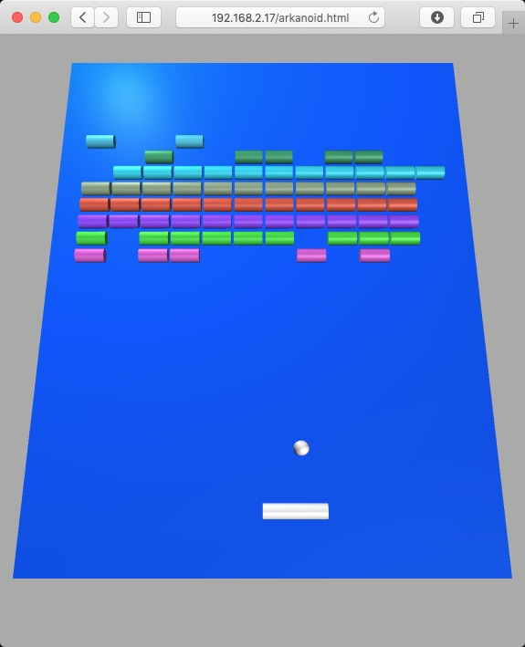

# A R K A N O I D    O N    E S P 3 2

*Play Arkanoid on a web page served by an ESP32.*

The Arkanoid game is served by an ESP32 to a web browser on a desktop computer or a smartphone and you can move the cursor with two physical buttons attached to the ESP. A third button enters automatic mode, i.e. the cursor moves automatically all the time.

It is also possible to play with a mouse or a touch screen, so if you only want to make a quick test, it is possible even without connecting buttons to the ESP.

The idea behind this project was to test the [ESPAsyncWebServer](https://github.com/me-no-dev/ESPAsyncWebServer/blob/master/README.md) library, especially the communication through WebSocket.

This program was tested with an *esp32doit-devkit-v1* and an *ESP32 M5Stack Core*.

It must be compiled with PlatformIO.

The game engine is written in JavaScript with the [threejs](https://threejs.org) library. I reused their example at <https://threejs.org/editor/> (click on `Examples/Arkanoid` in the top left menu and then on `Play`).

**The implementation of the game is very basic and is not complete (and probably never will be).**

## Prerequisites

Create the file `src/WifiSettings.h` manually and fill it in with the code below. Change the default values to make them meaningful. The mac address of the ESP32 will be automatically added to `ap_ssid` so that you can flash multiple ESPs with the same code, making sure their SSIDs are different.

    const char *ssid = "...";          // ssid of your WiFi network
    const char *password = "...";      // password of your WiFi network
    const char *ap_ssid = "ARKANOID-"; // ssid of the ESP32 WiFi network (15 char max)
    const char *ap_password = "";      // must be 8 char min or empty for no password

---

Change the board type (`env_default` flag) in `platformio.ini`. Currently there are two boards defined, but any ESP32 should work.

So if you have a regular ESP32 the `env_default` flag should be:

    env_default = esp32doit-devkit-v1

But if you have a M5STACK, it should be

    env_default = m5stack-core-esp32

---

The Arkanoid game will be served by the ESP32. So you need to upload the files by running the command below in a terminal  so that the ESP32 can serve them to the browser:

    platformio run --target uploadfs

> You can open the terminal directly in platformio with the rightmost button in the status bar in the bottom left of the vscode window.

---

If you want to control the game from the ESP, you need to connect three buttons to it. Change `BUTTON_A_PIN`, `BUTTON_B_PIN` and `BUTTON_C_PIN` in `platformio.ini` according to the pins to which you have connected the buttons.

---

Now you can upload the code to the ESP32. Once it is done, open a serial monitor and reboot the ESP. There will be two IP addresses displayed:

    STATION IP address:
    http://192.168.2.16/
    SOFT-AP IP address:
    http://192.168.4.1/

If the `STATION IP address` is `http://0.0.0.0/` that means your ESP is not connected to your WiFi network, but it is anyway possible to configure your computer or smartphone to connect directly to the WiFi network created by the ESP with the credentials you set in `src/WifiSettings.h`. The IP will be `SOFT-AP IP address`.

> If you have a M5STACK, you don’t need to open the serial monitor, the information will be displayed on the M5STACK screen.

## Play

Open your browser and go to `STATION IP address` or `SOFT-AP IP address` depending on your configuration. You should see a welcome page. Click on *Arkanoid* and play with your mouse or with the buttons attached to the ESP.

## Dependencies

Dependencies are defined under `lib_deps` in `platformio.ini` and are therefore automatically downloaded by PlatformIO when you open the project or when you build it.

I used the following example to make the [ESPAsyncWebServer](https://github.com/me-no-dev/ESPAsyncWebServer/blob/master/README.md) library work:
<https://gist.github.com/dsteinman/f792f0af25ce6d7d1db4b62d29dd4d9e>

> 2019, ouilogique.com
